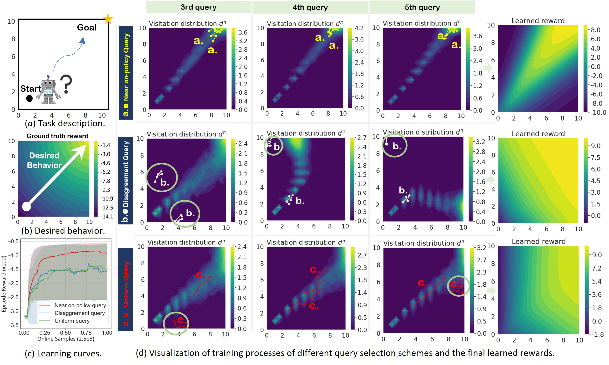
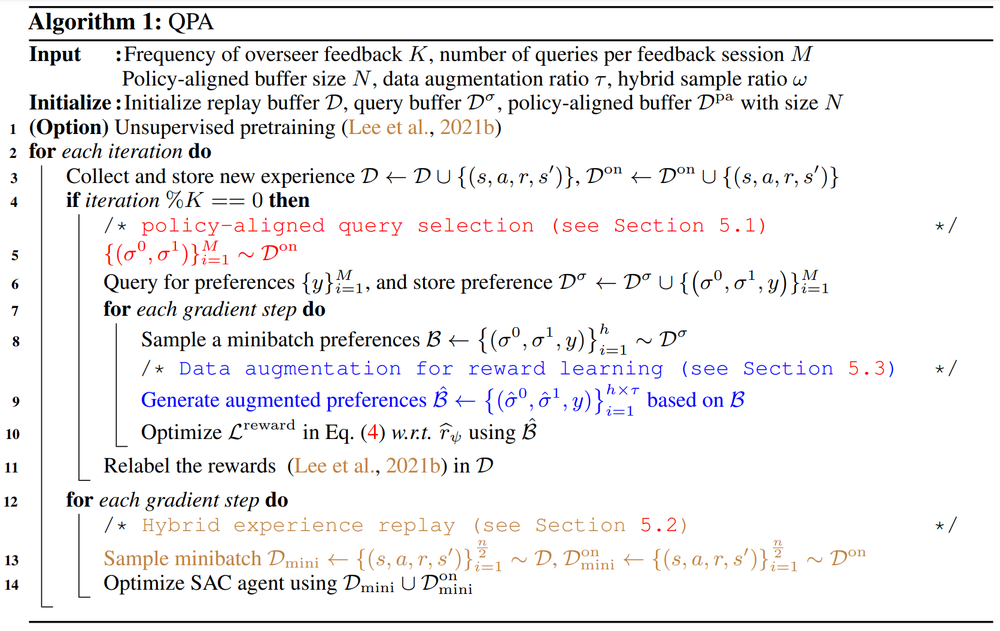

# Query-Policy Misalignment in Preference-Based Reinforcement Learning

This is the official implementation of [QPA (Query-Policy Alignment)](https://openreview.net/forum?id=UoBymIwPJR). This codebase is largely originated and modified from [BPref](https://github.com/rll-research/BPref).

## Brief Introduction

To improve feedback efficiency, most existing PbRL (Preference-based RL) methods focus on selecting queries to maximally improve the **overall** quality of the reward model, but we find that this may not necessarily lead to improved performance. We identify a long-neglected issue in the existing query selection schemes: **Query-Policy Misalignment**. This issue can be illustarted by the following figure: the selected segments of some existing query selection schemes typically fall outside the scope of the visitation distribution $d^\pi$ (marked with green circles). Therefore, although these selected segments may improve the overall quality of the reward model in the full state-action space, they contribute little to current policy training and potentially cause feedback inefficiency.



Query-Policy Misalignment can be effectively addressed via **policy-aligned query selection** and a specially designed **hybrid experience replay**, which together constitute our method: QPA. Given the limited feedback typically encountered in real-world scenarios, it is preferable to help current policy to get more local guidance using policy-aligned query selection.




## Install

```
conda env create -f conda_env.yml
pip install -e .[docs,tests,extra]
cd custom_dmcontrol
pip install -e .
cd custom_dmc2gym
pip install -e .
pip install git+https://github.com/rlworkgroup/metaworld.git@master#egg=metaworld
pip install pybullet
```

## Benchmark Experiments

The results of DM_Control tasks and Metaworld tasks can be reproduced with the following:

```
bash run_QPA.sh
```

## Visulization of Learning Curves

You can resort to [wandb](https://wandb.ai/site) to login your personal account via export your own wandb api key. Please specify wandb config manually and set 'wandb=true' in 'config/train_QPA.yaml', and

```
export WANDB_API_KEY=YOUR_WANDB_API_KEY
```

## Bibtex
If you find our code and paper can help, please cite our paper as:
```
@inproceedings{
hu2023query,
title={Query-policy misalignment in preference-based reinforcement learning},
author={Hu, Xiao and Li, Jianxiong and Zhan, Xianyuan and Jia, Qing-Shan and Zhang, Ya-Qin},
booktitle={The Twelfth International Conference on Learning Representations},
year={2024},
url={https://openreview.net/forum?id=UoBymIwPJR}
}
```